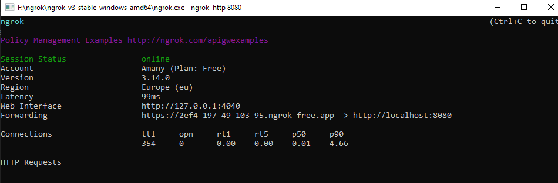

# ProjectIntializer

ProjectInitializer project aims to automate many steps whenever a project is created pn PlanRadar,
These steps are:
- adding a form to the project 
- adds an empty layer
- creates a ticket on that layer

## Used tools and languages:
- PlanRadar : to create the project and the form, and to use the webhook
- Java Language : programming language for implemting the required logic
- Spring Boot 
- Ngrok : to enable the tomcat server to be reached by the webhook request

## How to gain the whole experience:
- using Java, Spring Boot and Ngrok:
1) after downloading the source code you will need to confgure the required parameters in the file 'InitializerController' with the data you will get from PlanRadar
2) you can run file 'ProjectInitializerApplication.java' as it is the main class.
3) you will see that the code is running on port 8080, so we can configure Ngrok to this port so it can receive the requests through a public IP and route it.
"run Ngrok --> Type 'ngrok http 8080'"
you will see the below public IP which we will use to configure the webhook on plan radar, so it can send requests to it.

- using PlanRadar:
1) Create the form with 'Title' and 'Status' inputs ang get it ID
2) Get the 'Token' and 'CustomerID' required for calling the APIs
3) Configure the Webhook IP with the IP appeared on Ngrok terminal to trigger a request to the code running on your machine whenever a project is Created

The code will be listening to the requests coming from the webhook, once it receive a request it will do the below logic:
1) Read the project ID of the created Project
2) Set the required parameters assigned previously
3) call the method 'AddTicketTypeRequest(SampleFormID , "application/json")'
to add the sample form to the newly created project, and returning the ticket-type-id required in the coming steps
4) on Success of the previous step, it will call the method 'CreateComponent(ComponentName)' to create the component and return the component id.
5) on Success of the previous step, , it will call 'CallCreateTicket("application/json",TicketTypeID, ComponentID , TicketTitle , TicketStatus)' method to create the ticket using the IDs returned from previous steps and the sample names you have configured.

